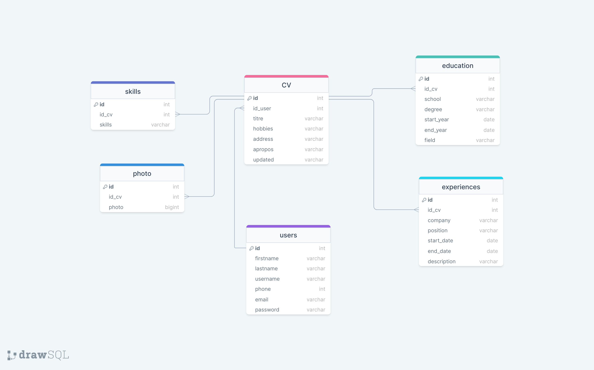

# Generateur-de-CV

Ce projet PHP B2 vise à fournir une plateforme permettant de créer, afficher, modifier et générer des CV au format PDF en ligne. L'objectif est de simplifier le processus de création de CV en offrant une interface conviviale et des fonctionnalités utiles.

## Fonctionnalités

- Création de compte utilisateur
- Création, affichage, modification et suppression de CV
- Choix parmi différents templates de CV
- Possibilité d'ajouter une photo au CV
- Génération de CV au format PDF
- Sécurité minimale pour protéger les données utilisateur
- Possibilité de partager un CV (bonus)
- CV en ligne (bonus)

## Prérequis

XAMPP (PHPmyadmin)

Navigateur web (Chrome, Opera, Edge)

## Installation

Clonez le dépôt GitHub dans votre répertoire de travail local :

```bash
https://github.com/Roockbye/Generateur-de-CV.git
```

Configurez Laragon pour exécuter le projet PHP en définissant le répertoire racine sur le dossier cloné.

Importez le fichier de base de données fourni (MCD/MLD) dans votre système de gestion de bases de données.

Configurez les informations de connexion à la base de données dans le fichier config.php.

Ouvrez le projet dans votre navigateur web en accédant à l'URL locale configurée dans Laragon.

Suivez les étapes de création de compte, puis commencez à créer votre CV en ligne.

## MCD/MLD



MLD:

    Users :
        ID (PK, INT)
        lastname (VARCHAR)
        firstname (VARCHAR)
        Email (VARCHAR)
        password (VARCHAR)
        username(VARCHAR)
        phone (INT)

    CV :
        id (PK, INT)
        id_user (FK, INT)
        Titre (VARCHAR)
        hobbies (VARCHAR)
        address(VARCHAR)
        apropos(VARCHAR)
        updated(INT)

    Expériences :
        ID (PK, INT)
        ID_CV (FK, INT)
        company (VARCHAR)
        Position (VARCHAR)
        start_date (DATE)
        end_date (DATE)
        Description (TEXT)

    Education :
        ID (PK, INT)
        ID_CV (FK, INT)
        School (VARCHAR)
        degree (VARCHAR)
        field (VARCHAR)
        start_year (DATE)
        end_year (DATE)

    Skills :
        ID (PK, INT)
        ID_CV (FK, INT)
        skills(VARCHAR)

    Photo :
        ID (PK, INT)
        ID_CV (FK, INT)
        photo(VARCHAR)


*PK (Primary Key)

*FK (Foreign Key)

## Utilisation

- Création de compte : Commencez par créer un compte utilisateur en fournissant les informations requises.

- Connexion : Une fois le compte créé, connectez-vous à votre compte.

- Création de CV : Créez un nouveau CV en choisissant parmi différents templates disponibles et en remplissant les champs obligatoires.

- Modification de CV : Vous pouvez à tout moment modifier ou supprimer un CV existant en accédant à la section correspondante.

- Ajout de photo : Vous avez la possibilité d'ajouter une photo à votre CV lors de sa création ou de sa modification.

- Génération de PDF : Une fois votre CV créé ou modifié, vous pouvez le générer au format PDF en un seul clic.


...En cours